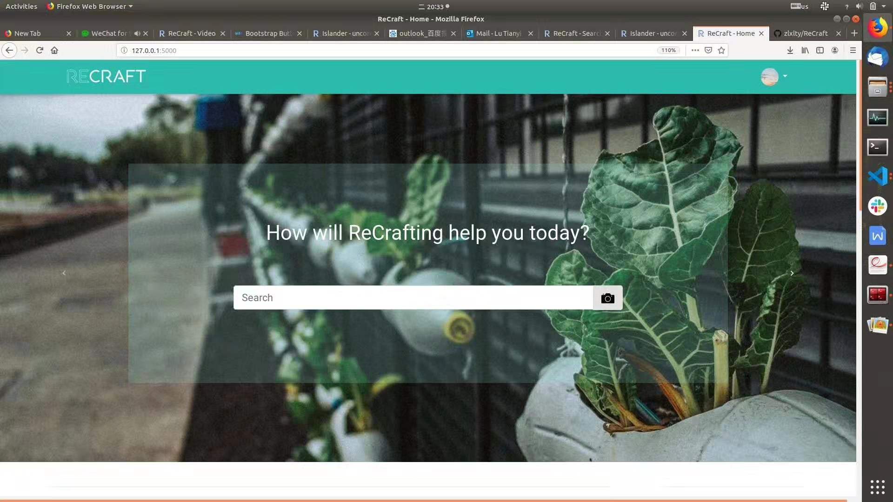
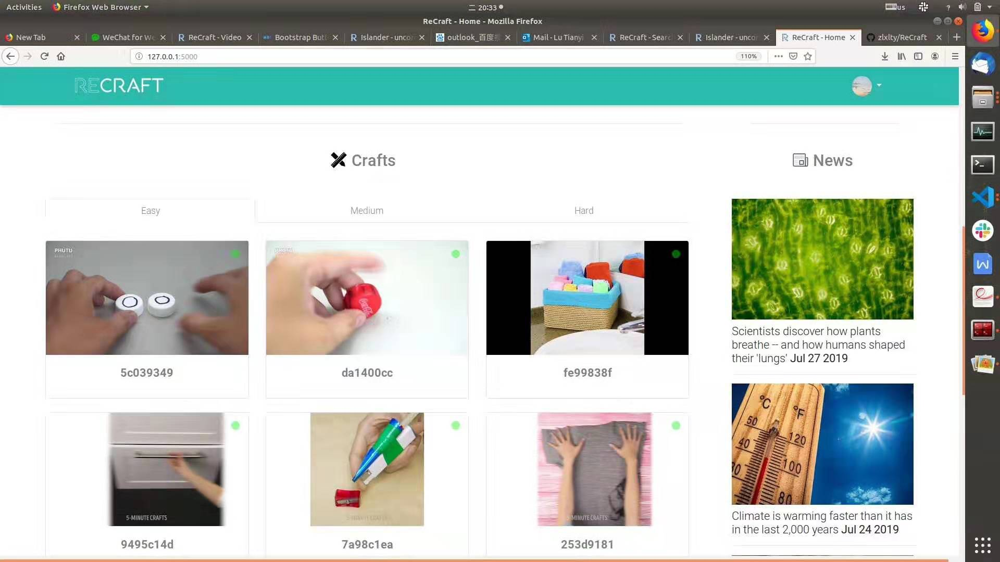
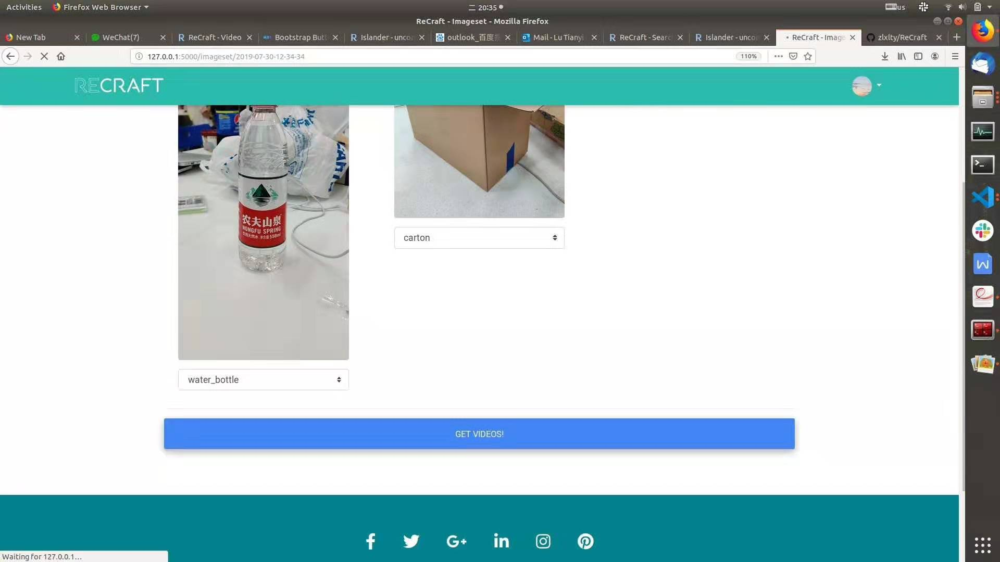
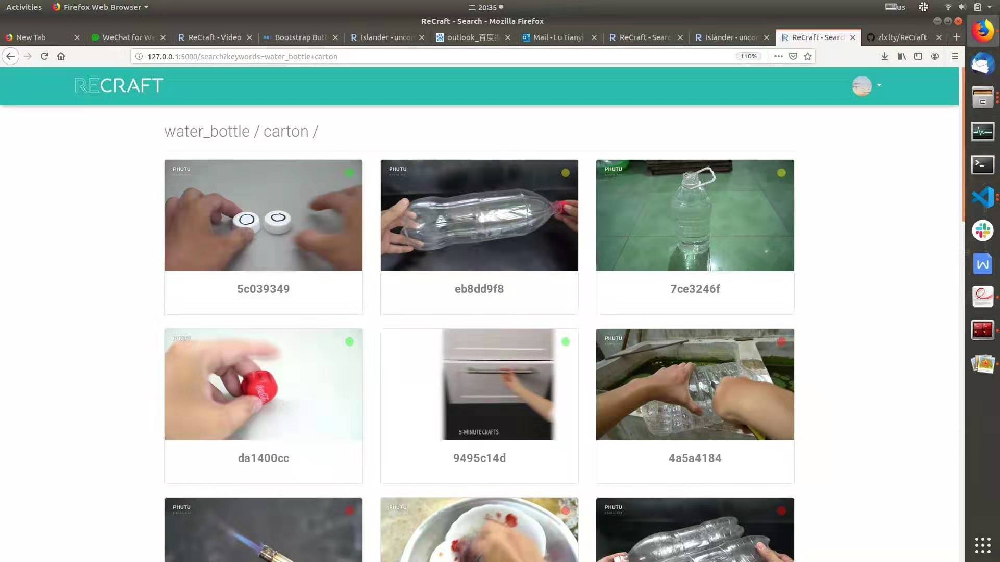
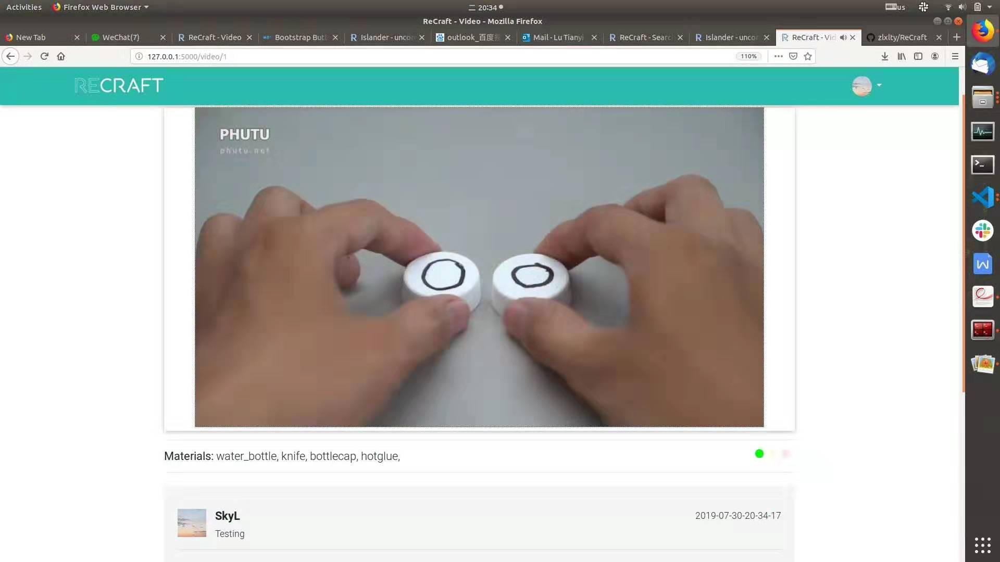
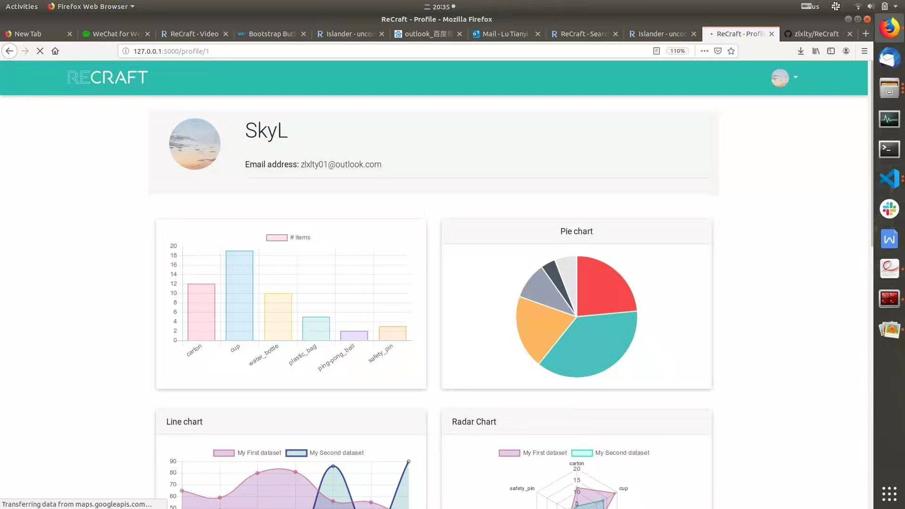

<!--
 * @Description: Edit
 * @Author: Tianyi Lu
 * @Date: 2019-08-01 17:16:32
 * @LastEditors: Tianyi Lu
 * @LastEditTime: 2019-10-13 21:42:20
 -->
ReCraft
=====
### ReCraft is a project for TechX 2019 Hackathon <!-- omit in toc -->
<div align=center></div>

## Content <!-- omit in toc -->
- [ReCraft](#ReCraft)
  - [Main Functions](#Main-Functions)
  - [Getting_Started](#GettingStarted)
    - [Prerequisites](#Prerequisites)
    - [Installing](#Installing)

- [ ] todo

***
## Main Functions
<div align=center></div>
Main Page
<div align=center></div>
Image Identification
<div align=center></div>
Get Videos according to the tags identified
<div align=center></div>
Learn Tutorials and share thoughts
<div align=center></div>
Receive analysis for recycling behaviors

## Getting_Started
### Prerequisites
* Python 3.6.x (3.7.x is not supported)
  * If you haven't installed anaconda on your computer, here is the URL link to [Download Anaconda](https://www.anaconda.com/download)
* Virtualenv
* Mac OS or Linux
```
$ sudo apt-get install python3-venv
```
### Installing
1. Click the top-right `Fork` button and fork my repo to your own repo
2. Clone your repo to your local computer
```
$ git clone https://github.com/<your_username>/Islandr.git
$ cd Islandr
```
3. Create Virtualenv
```
$ python3 -m venv venv
```
4. Add FLASK_APP to your activate shell file
```
$ vim venv/bin/activate
```
<p style="text-indent:2em;">Add this line at the buttom of activate file</p>

```shell
export FLASK_APP=recraft.py
```
<p style="text-indent:2em;">Save and exit the file by pressing `Contrl+C` and `:wq`</p>  

5. Activate Virtualevn and install dependencies
```
(venv)$ source venv/bin/activate
(venv)$ pip install -r requirements.txt
```
6. Create index for search function and create database
```
(venv)$ flask deploy
```
7. Run your flask app
```
(venv)$ flask run
```
8. Go to http://127.0.0.1:5000/ and see the app running
****

| Author |             zlxlty |
| :----- | -----------------: |
| E-mail | skylty01@gmail.com |

$$
f(x) = \int_{-\infty}^\infty \hat{f(x)}, e^{2 \pi i x}
$$

****
